# NatraTax — Architectural Blueprint & Master Specifications
**Target Organization**: SMK BINA PUTRA JAKARTA  
**Application Name**: NatraTax — School Tax & Financial Administration System  
**Version**: 1.0 (Enterprise Production Build)

---

## 1. Executive Summary & Design Translation

NatraTax is an internal school and foundation (*yayasan*) tax and financial administration platform engineered specifically for **SMK BINA PUTRA JAKARTA**. 

### Reference Screenshot Deconstruction & Evolution
From our analysis of the visual references (`PrakTax` structure):
- **Top Header**: Retains the executive brand header with NatraTax logo, Version badge (`Versi 1.0`), prominent amber Disclaimer badge (*Sistem Administrasi Internal Sekolah — Bukan Pengganti DJP/Coretax*), global search with `Cmd/Ctrl+K` command palette, language indicator (`ID`), theme switcher (Light / Dark / System), notification center, and active user credential bar (`998866000010609` / `DUWI HERU SANTOSO, S.AK` / `BENDAHARA`).
- **Secondary Main Navigation**: 8 core modules:
  1. `Portal Saya`
  2. `e-Faktur`
  3. `e-Bupot`
  4. `SPT`
  5. `Pembayaran`
  6. `Buku Besar`
  7. `Layanan`
  8. `Manajemen`
- **Left Context-Aware Sidebar**: Displays the signature royal purple/indigo organization identification card for **SMK BINA PUTRA JAKARTA**, followed by active sub-menus matching the top-level route.
- **Main Content**: Breadcrumbs (`Beranda > E Faktur > Dashboard`), page headers with icon, period selector dropdown (`September-2026`), high-impact metric cards, action buttons (`+ Buat Konsep SPT`, `+ Tambah Transaksi`), table column filters, compact toggle ("Padatkan"), pagination ("Baris per halaman"), and clean empty/loaded states.
- **Aesthetic Uplift**: Replaces rigid borders with refined 8px spacing, clean modern typography (Inter/Plus Jakarta Sans), rich status indicators, fluid micro-interactions, responsive mobile drawers, and dark mode support.

---

## 2. Information Architecture (IA)

```mermaid
graph TD
    App[NatraTax Platform] --> Auth[Login & Impersonation]
    App --> Portal[Portal Saya]
    App --> Faktur[e-Faktur]
    App --> Bupot[e-Bupot]
    App --> SPT[SPT Module]
    App --> Bayar[Pembayaran]
    App --> Buku[Buku Besar]
    App --> Layanan[Layanan Pajak]
    App --> Mgmt[Manajemen]

    Portal --> P1[Dashboard Utama]
    Portal --> P2[Profil SMK Bina Putra]
    Portal --> P3[Rekening & NPWP]
    Portal --> P4[Aktivitas & Log]

    Faktur --> F1[Dashboard Faktur]
    Faktur --> F2[Pajak Keluaran]
    Faktur --> F3[Pajak Masukan]
    Faktur --> F4[Faktur Retur & Batal]

    Bupot --> B1[Dashboard e-Bupot]
    Bupot --> B2[BP 21 - Honor Guru/Pegawai]
    Bupot --> B3[BPPU - Pasal 22/23 Jasa & Barang]
    Bupot --> B4[BPNR & PPh Final 4-2]

    SPT --> S1[Dashboard SPT]
    SPT --> S2[Konsep SPT Masa]
    SPT --> S3[SPT Menunggu Bayar/Verifikasi]
    SPT --> S4[SPT Dilaporkan & Arsip]

    Bayar --> PY1[Tagihan Pajak / Billing]
    Bayar --> PY2[Menunggu Pembayaran]
    Bayar --> PY3[Sudah Bayar & Bukti NTPN]
    Bayar --> PY4[Rekonsiliasi Bank BOS/Yayasan]

    Buku --> BB1[Jurnal Transaksi]
    Buku --> BB2[Jurnal Pajak]
    BB1 --> BB3[Buku Besar Pembantu]

    Mgmt --> M1[Master Data Vendor]
    Mgmt --> M2[Aturan & Tarif Pajak]
    Mgmt --> M3[Manajemen User & Hak Akses]
    Mgmt --> M4[Audit Trail Terenkripsi]
```

---

## 3. Database Architecture (Multi-Tenant Ready Schema)

All core operational tables include `tenant_id` (defaulting to UUID of SMK Bina Putra Jakarta).

### Key Entities & Relations
1. **tenants**: `id`, `name`, `code`, `tax_id` (NPWP), `address`, `status`, `created_at`.
2. **users**: `id`, `tenant_id`, `name`, `email`, `password_hash`, `tax_id_number` (NPWP/NIK), `phone`, `role`, `status`, `last_login_at`.
3. **vendors**: `id`, `tenant_id`, `name`, `type` (`individual`, `corporate`), `npwp`, `nik`, `address`, `bank_name`, `bank_account`, `category`.
4. **tax_types**: `id`, `code` (`PPN`, `PPH21`, `PPH22`, `PPH23`, `PPH4_2`), `name`, `description`.
5. **tax_rules**: `id`, `tax_type_id`, `rule_code`, `object_code`, `rate_percentage`, `effective_from`, `effective_to`, `is_active`, `version`.
6. **transactions**: `id`, `tenant_id`, `trx_number`, `trx_date`, `type` (`pengadaan_bos`, `honor_guru`, `sewa`, `jasa_perbaikan`), `vendor_id`, `description`, `gross_amount`, `dpp`, `tax_rate`, `tax_amount`, `net_amount`, `status` (`draft`, `under_review`, `approved`, `paid`, `cancelled`), `created_by`.
7. **invoices**: `id`, `tenant_id`, `transaction_id`, `invoice_type` (`keluaran`, `masukan`), `invoice_number`, `tax_invoice_number` (NSFP/Kode Faktur), `date`, `counterparty_name`, `counterparty_npwp`, `dpp`, `ppn_rate`, `ppn_amount`, `status`.
8. **withholding_slips (e-Bupot)**: `id`, `tenant_id`, `transaction_id`, `bupot_number`, `bupot_type` (`BP21`, `BP22`, `BP23`, `BP4_2`), `tax_object_code`, `beneficiary_name`, `beneficiary_npwp_nik`, `gross_amount`, `tax_rate`, `tax_withheld`, `period_month`, `period_year`, `status`.
9. **spt_records**: `id`, `tenant_id`, `spt_type` (`Masa_PPN`, `Masa_PPh21`, `Masa_Unifikasi`, `Tahunan_Badan`), `period_month`, `period_year`, `total_dpp`, `total_tax`, `billing_code`, `status` (`konsep`, `menunggu_verifikasi`, `siap_lapor`, `dilaporkan`), `ntpn`.
10. **payments**: `id`, `tenant_id`, `billing_code`, `tax_type`, `period`, `amount`, `due_date`, `paid_at`, `channel`, `ntpn`, `status` (`pending`, `paid`, `late`).
11. **audit_logs**: `id`, `tenant_id`, `user_id`, `action`, `module`, `record_id`, `old_values`, `new_values`, `ip_address`, `created_at`.

---

## 4. Role & Permission Matrix (RBAC)

| Role | Dashboard | Transaksi | e-Faktur | e-Bupot | SPT | Pembayaran | Master Data | Audit Log |
|---|---|---|---|---|---|---|---|---|
| **SUPER ADMIN** | View | Full | Full | Full | Full | Full | Full | View/Export |
| **KEPALA SEKOLAH** | View | Approve | View | View | Approve | Approve | View | View |
| **BENDAHARA** | View | Full | Full | Full | Full | Process | Full | View |
| **ADMIN PAJAK** | View | Create/Edit | Full | Full | Full | Input Billing | Edit Rules | View |
| **VERIFIKATOR** | View | Review/Reject| Verify | Verify | Review | Verify | View | View |
| **OPERATOR** | View | Create/Draft| Draft | Draft | Draft | View | View | - |
| **AUDITOR** | View | Read-only | Read-only| Read-only| Read-only| Read-only | Read-only | Full View |

---

## 5. Tax Rule Engine Specifications (School & Yayasan Context)
- **PPN (Pajak Pertambahan Nilai)**: Standard rate 11% (and configurable 12% readiness); Pengadaan sarana & prasarana sekolah via SIPLah / BOS.
- **PPh Pasal 21**:
  - Honor Guru Tidak Tetap (GTT) / Tenaga Kependidikan Honorer: 5% dari 50% Ph. Bruto kumulatif atau tarif progresif tanpa PTKP jika tidak ber-NPWP (+20%).
  - Tenaga Ahli / Narasumber Workshop SMK: 5% x 50% x Penghasilan Bruto.
- **PPh Pasal 22**:
  - Pembelian barang/ATK oleh Bendahara Pengeluaran SMK dengan dana BOS di atas Rp 2.000.000 (tidak termasuk PPN): 1.5%.
- **PPh Pasal 23**:
  - Jasa pemeliharaan laboratorium/AC/keamanan/kebersihan sekolah: 2%.
- **PPh Final Pasal 4 Ayat 2**:
  - Sewa tanah/gedung/kantin yayasan: 10%.
  - Jasa konstruksi rehab ruang kelas/lab: 1.75% - 2.65% (tergantung kualifikasi).
